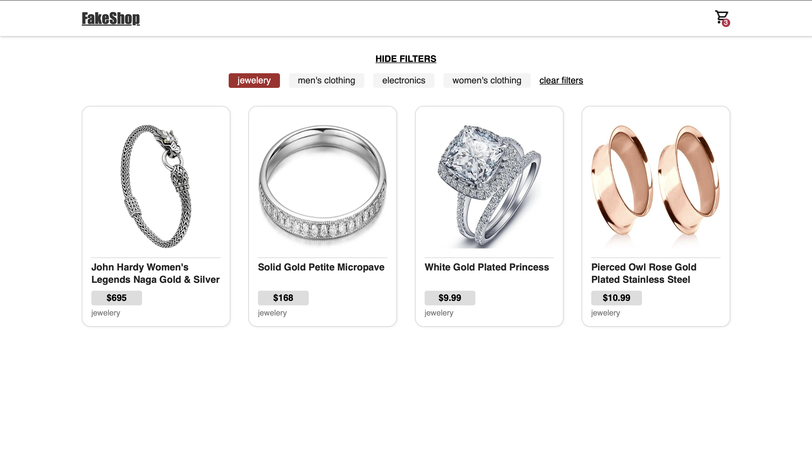
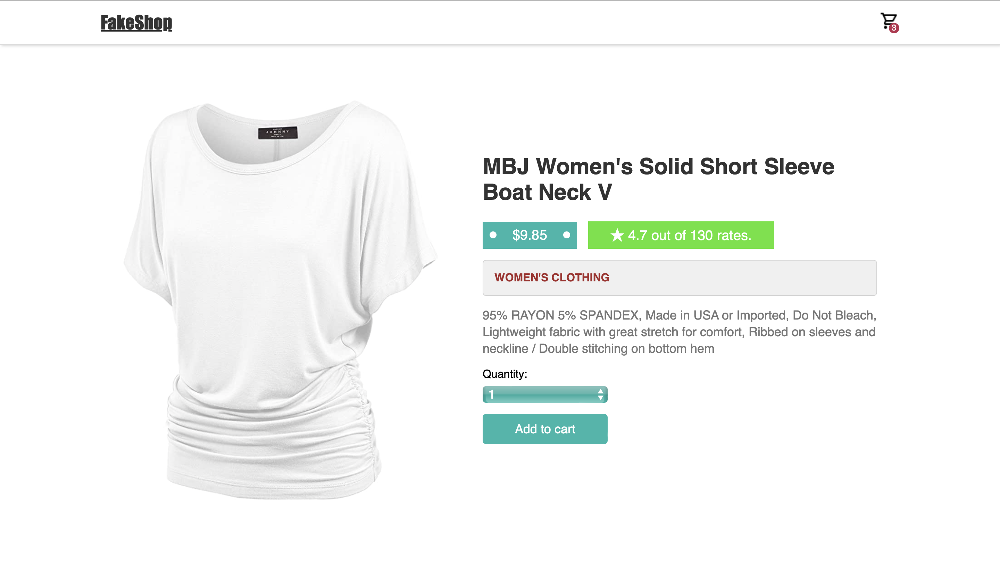
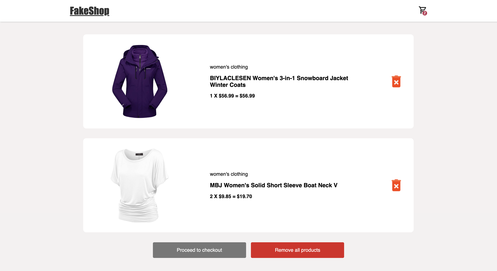

# Redux FakeShop website

Simple React E-Commerce responsive application created mainly through practicing React Redux, with a little bit use of react-router, axios, react-toastify & aos.

Available options:
- Filtering all existing products with 4 categories & clearing the filter option.
- Clicking on any of the products to open the product page.
- Option to choose product quantity before adding it to the cart.
- Option to add product/s to the cart. (Products added to cart are saved to local storage).
- Removing one chosen product type from the cart.
- Removing all products from the cart at once.
- Mobile version (website is responsive).


### Screenshot of products page


### Screenshot of single product page


### Screenshot of cart



## Running instructions

Install the needed dependencies

```bash
  npm install
```

Once the setup is complete, run the project

```bash
  npm run dev
```

[Website Live Version](https://fakeshop-project.netlify.app)
